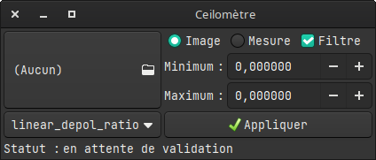

# Ceilomètre

## Présentation
Le Ceilomètre est un appareil de mesure qui permet d'accéder, entre autre à la concentration de particules ainsi qu'à leurs tailles et formes. Ce petit logiciel permet de tracer les profils verticaux en analysant les fichiers NetCDF de l'instrument.

## Licence
La totalité du code est soumis à la licence GNU General Public Licence v3.0.

## Utilisation

### Dépendances
Ce logiciel nécessite :

 – netcdf >= 4.9.0

 – gtk3

 – SDL2

### Installation
Pour installer le logiciel, il faut compiler avec `make` puis `make install`.
Dans le cadre d'une réinstallation ou d'une mise à jour, faites `make clear` avant.

### Déinstallation
Pour désinstaller : `make clear`.
