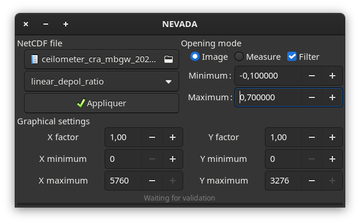

# NEVADA (NetCDF Explorer and Visualizer for Atmospheric Data Analysis)

## Présentation
NEVADA (NetCDF Explorer and Visualizer for Atmospheric Data Analysis) est un petit logiciel permettant d'ouvrir et de représenter graphiquement des fichiers NetCDF.



## Licence
La totalité du code est soumis à la licence GNU General Public Licence v3.0.

## Utilisation

### Dépendances
Pour devez avoir les paquets suivants :

 - netcdf >= 4.9.0
 - gtk3
 - SDL2

### Installation
Pour installer NEVADA, il faut suivre la démarche standard :
```
$ git clone 
$ cd NEVADA
$ make
$ make install
```
dans le cadre d'une réinstallation ou d'une mise à jour, faites `make clear` avant.

### Mise à jour
Pour mettre à jour NEVADA :
```
$ cd NEVADA
$ make clear
$ git pull
$ make
$ make install
```
### Désinstallation
Pour désinstaller :
```
$ cd NEVADA
$ make clear
$ cd ../
$ rm -rf NEVADA
```
